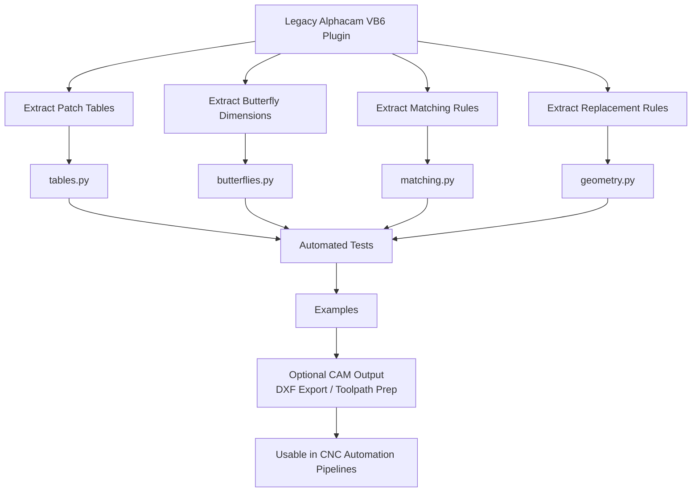

# Patch‑Matcher

Modern Python rewrite of the original VB6 Patch‑Matcher plugin for Alphacam.  
The original repository is here: https://github.com/PCipolle/Patch-Matcher  
The VB6 version had no license; this project is a clean re‑implementation based on observed behavior and data files.

This project extracts the CNC‑relevant logic from the legacy plugin and reorganizes it into a maintainable, testable Python package.

---

## Purpose

The original Alphacam plugin automated three tasks used in woodworking and CNC routing:

1. Patch selection based on rectangle size  
2. Geometry replacement with a matched patch and center hole  
3. Butterfly inlay generation using fixed dimension tables  

This rewrite preserves those behaviors without Alphacam dependencies.

---

## What was extracted

- Patch size tables (top, bottom, wood, bronze)  
- Butterfly dimension tables (W1-W7, B1-B2)  
- Closest‑patch matching rules  
- Rectangle replacement rules  
- Center‑hole placement  
- Angle and offset logic  

All logic was rewritten in Python.  
No VB6 code was copied.

---

## What was not included

The following elements were specific to Alphacam and were intentionally excluded:

- COM API calls  
- VB6 UI forms  
- Toolpath generation  
- Tool libraries  
- Event handling  
- Machine‑specific settings  

The goal is a clean, portable logic layer.

---

## Project structure

```
patchmatcher/        # Modern Python implementation
config/              # Patch tables and butterfly definitions
examples/            # Usage demonstrations
tests/               # Full pytest suite
```

This project is a clean re‑implementation. No VB6 source code is included or reused.

---

## CNC workflow diagram



---

## Tests

The project includes a complete pytest suite covering:

- patch table loading  
- geometry primitives  
- matching logic  
- butterfly parameter lookup  
- example execution  

All tests pass.

---

## How to run the examples

The examples are regular Python modules.  
Run them from the project root so the `patchmatcher` package can be imported correctly.

### Run an example

```
python -m examples.demo_search_and_replace
```

### Expected output

```
Original: Rectangle(width=3.1, height=4.9, cx=10, cy=20)
Matched patch: Rectangle(width=3.0, height=5.0, cx=10, cy=20)
Center hole: Circle(radius=0.05, cx=10, cy=20)
```

Here’s a clean, polished **CLI section** you can drop directly into your README.  
It fits your existing structure and keeps the tone consistent with the rest of the document.

---

## Command‑Line Interface (CLI)

Patch‑Matcher includes a lightweight command‑line interface that exposes the core functionality of the library without writing any Python code.  
Once the package is installed, the `patchmatcher` command becomes available system‑wide.

### Installation (editable or local)

```
pip install .
```

After installation, the following commands are available.

---

### `match` — Find the closest patch

Given a rectangle width and height, this command searches the selected patch table and returns the closest matching patch size.

```
patchmatcher match --width 3.1 --height 4.9 --table config/patchSizesTop.txt
```

**Output:**

```
Matched patch: 3.0 x 5.0
```

---

### `replace` — Replace geometry with a matched patch

This performs the full geometry replacement:  
- finds the closest patch  
- creates a new rectangle  
- generates the center hole  

```
patchmatcher replace \
    --width 3.1 \
    --height 4.9 \
    --cx 10 \
    --cy 20 \
    --table config/patchSizesTop.txt
```

**Output:**

```
New rectangle: 3.0 x 5.0 at (10.0, 20.0)
Center hole: radius 0.05 at (10.0, 20.0)
```

Optional adjustments:

```
--x-adjust 0.1
--y-adjust 0.2
```

---

### `butterfly` — Lookup butterfly inlay parameters

Retrieves the parametric definition for any butterfly code (W1–W7, B1–B2).

```
patchmatcher butterfly W3
```

**Output:**

```
Butterfly W3:
  diam1: 0.05
  diam2: 0.05
  circ_offset: 0.60
  line1: 1.01247
  offset: 0.30823
  angle: 9
  z_bottom: -0.5
  radius1: 0
  radius2: 0
```

---

### Running the CLI without installation

You can also invoke the CLI directly from the project root:

```
python -m patchmatcher match --width 3.1 --height 4.9 --table config/patchSizesTop.txt
```

---

## JSON and DXF Output

Patch‑Matcher can be used as part of automated CNC workflows by reading geometry from JSON files and exporting results in either JSON or DXF format.  
These options integrate cleanly with external preprocessors, CAM pipelines, or batch‑processing scripts.

### JSON input

Instead of specifying geometry on the command line, you can provide a JSON file:

```json
{
  "width": 3.1,
  "height": 4.9,
  "cx": 10,
  "cy": 20
}
```

Run the replacement using:

```
patchmatcher replace --json-in input.json --table config/patchSizesTop.txt
```

This performs the same patch‑matching and geometry replacement as the standard CLI call.

---

### JSON output

To write the result to a JSON file:

```
patchmatcher replace \
    --width 3.1 \
    --height 4.9 \
    --cx 10 \
    --cy 20 \
    --table config/patchSizesTop.txt \
    --json-out result.json
```

The output file contains the new rectangle and center‑hole geometry:

```json
{
  "rectangle": {
    "width": 3.0,
    "height": 5.0,
    "cx": 10.0,
    "cy": 20.0
  },
  "center_hole": {
    "radius": 0.05,
    "cx": 10.0,
    "cy": 20.0
  }
}
```

This format is suitable for downstream automation or integration with CNC toolpath generators.

---

### DXF export

Patch‑Matcher can also export the replaced geometry as a minimal DXF file containing:

- a rectangular LWPOLYLINE  
- a circular center hole  

Example:

```
patchmatcher replace \
    --width 3.1 \
    --height 4.9 \
    --cx 10 \
    --cy 20 \
    --table config/patchSizesTop.txt \
    --dxf-out output.dxf
```

The resulting DXF can be imported into CAD/CAM software or used as part of a CNC preprocessing pipeline.
