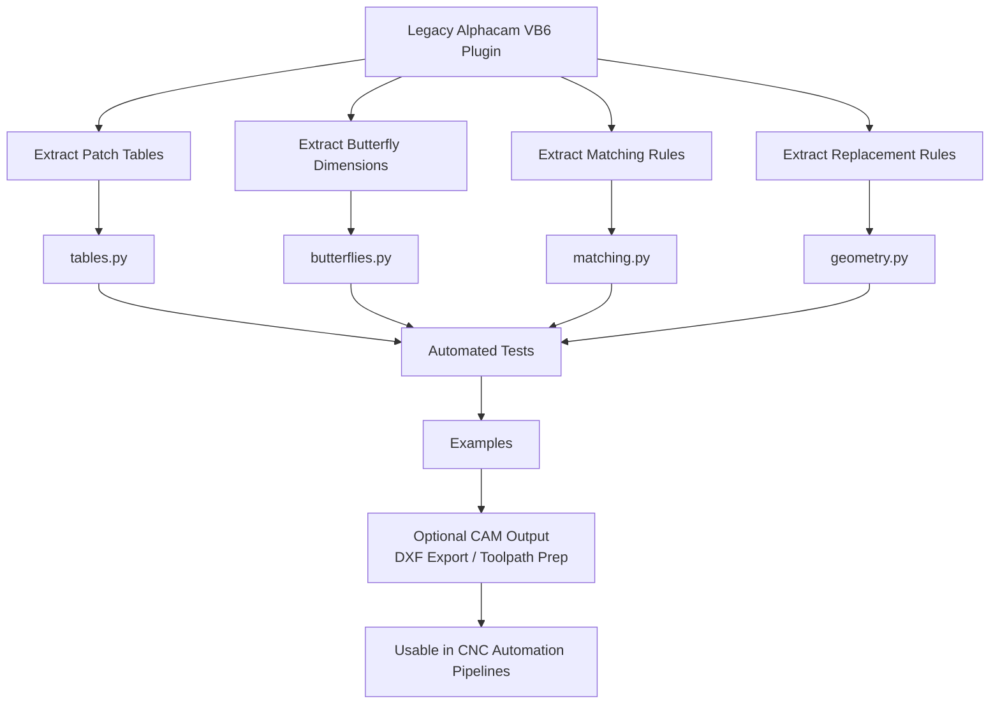

# Patch‑Matcher

Modern Python rewrite of the original VB6 Patch‑Matcher plugin for Alphacam.  
The original repository is here: https://github.com/PCipolle/Patch-Matcher  
The VB6 version had no license; this project is a clean re‑implementation based on observed behavior and data files.

This project extracts the CNC‑relevant logic from the legacy plugin and reorganizes it into a maintainable, testable Python package.

---

## Purpose

The original Alphacam plugin automated three tasks used in woodworking and CNC routing:

1. Patch selection based on rectangle size  
2. Geometry replacement with a matched patch and center hole  
3. Butterfly inlay generation using fixed dimension tables  

This rewrite preserves those behaviors without Alphacam dependencies.

---

## What was extracted

- Patch size tables (top, bottom, wood, bronze)  
- Butterfly dimension tables (W1-W7, B1-B2)  
- Closest‑patch matching rules  
- Rectangle replacement rules  
- Center‑hole placement  
- Angle and offset logic  

All logic was rewritten in Python.  
No VB6 code was copied.

---

## What was not included

The following elements were specific to Alphacam and were intentionally excluded:

- COM API calls  
- VB6 UI forms  
- Toolpath generation  
- Tool libraries  
- Event handling  
- Machine‑specific settings  

The goal is a clean, portable logic layer.

---

## Project structure

```
patchmatcher/        # Modern Python implementation
config/              # Patch tables and butterfly definitions
examples/            # Usage demonstrations
tests/               # Full pytest suite
```

This project is a clean re‑implementation. No VB6 source code is included or reused.

---

## CNC workflow diagram



---

## Tests

The project includes a complete pytest suite covering:

- patch table loading  
- geometry primitives  
- matching logic  
- butterfly parameter lookup  
- example execution  

All tests pass.

---

## How to run the examples

The examples are regular Python modules.  
Run them from the project root so the `patchmatcher` package can be imported correctly.

### Run an example

```
python -m examples.demo_search_and_replace
```

### Expected output

```
Original: Rectangle(width=3.1, height=4.9, cx=10, cy=20)
Matched patch: Rectangle(width=3.0, height=5.0, cx=10, cy=20)
Center hole: Circle(radius=0.05, cx=10, cy=20)
```
